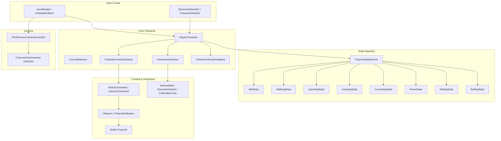

# 🏹 Character Mini PL - Base para Juego de Caza en Tercera Persona

[-blue.svg?logo=unity)](https://unity.com/)
[](https://docs.unity3d.com/Packages/com.unity.render-pipelines.universal@latest)
[](https://docs.unity3d.com/Packages/com.unity.inputsystem@latest)
[](https://docs.unity3d.com/Packages/com.unity.cinemachine@latest)

Base arquitectónica modular y extensible para un videojuego de acción / caza en tercera persona (*hunting game*), desarrollada en **Unity 6** con **Universal Render Pipeline (URP)**. Implementa patrones de diseño limpios (Máquina de Estados, Patrón Comando, Observer, Flyweight) con soporte completo para teclado/ratón y gamepad.

---

## 📋 Tabla de Contenidos

- [Características Principales](#-características-principales)
- [Requisitos del Sistema](#-requisitos-del-sistema)
- [Guía de Instalación y Puesta en Marcha](#-guía-de-instalación-y-puesta-en-marcha)
- [Mapeo de Controles](#-mapeo-de-controles)
  - [Teclado y Ratón](#teclado-y-ratón)
  - [Mando / Gamepad](#mando--gamepad)
- [Mecánicas del Jugador](#-mecánicas-del-jugador)
- [Arquitectura del Proyecto](#-arquitectura-del-proyecto)
- [Guía Detallada de Scripts (Variables y Funcionalidades)](GUIA_SCRIPTS.md)
- [Estructura de Carpetas](#-estructura-de-carpetas)
- [Resolución de Problemas Frecuentes](#-resolución-de-problemas-frecuentes)

---

## ✨ Características Principales

- **Locomoción y Posturas Tácticas:**
  - Sistema de estados para **Idle**, **Caminar**, **Correr (Sprint)** y **Salto**.
  - Transiciones fluidas a posturas tácticas: **Agachado (Crouch)** y **Cuerpo a tierra (Prone)**, adaptando dinámicamente el `CharacterController`.
  - Maniobras evasivas: **Deslizamiento (Slide)** al agacharse en carrera y **Voltereta/Rodar (Roll)**.
- **Sistema de Cámara en Tercera Persona:**
  - Control orbital con **Cinemachine 3 / 6**.
  - Zoom dinámico ajustable con la rueda del ratón o bumpers del mando.
  - Modo **Apuntado sobre el hombro (Over-The-Shoulder Aim)** con transición de cámara, activación de retícula (`miraDisparo`) y orientación precisa del cuerpo y cabeza (`EyeTarget`).
- **Sistema de Combate y Armas:**
  - Disparo de proyectiles físicos (`Bullet`) con retroceso visual procedimental (recoil), destellos de cañón (muzzle flash) y audio espacial.
  - **Ataque Cargado:** Soporta disparos rápidos y disparos cargados manteniendo presionado el botón, con escalado de daño y retroalimentación en pantalla (barra de carga dinámica en el HUD).
  - Daño a entidades mediante la interfaz `IDamageable` e impacto físico mediante `Rigidbody`.
- **Sistema de Interacción en el Mundo:**
  - Detección de proximidad no asignativa (`Physics.OverlapSphereNonAlloc`) mediante `InteractionDetector`.
  - Objetos interactuables con la interfaz `IInteractable`:
    - **Interruptores (`InteractiveSwitch`):** Cambian de estado activado/desactivado con cambio de color y eventos.
    - **Coleccionables (`CollectibleCube`):** Efecto de pulsación lumínica por proximidad y recolección al interactuar.
- **Feedback Visual Integrado:**
  - Modificación dinámica de color del modelo en tiempo de ejecución (`MaterialPropertyBlock`) para depuración y retroalimentación visual de cada estado, daño e interacciones.

---

## 💻 Requisitos del Sistema

- **Versión de Unity:** `Unity 6 (6000.6.0f1)` o superior.
- **Render Pipeline:** Universal Render Pipeline (URP).
- **Paquetes Requeridos** (gestionados automáticamente en `Packages/manifest.json`):
  - `com.unity.inputsystem` (1.20.0 o superior)
  - `com.unity.cinemachine` (6.6.0 o superior)
  - `com.unity.render-pipelines.universal` (17.6.0 o superior)
  - `com.unity.ugui` (2.6.0 o superior)

---

## 🚀 Guía de Instalación y Puesta en Marcha

Sigue estos pasos para abrir y probar el proyecto desde cero:

1. **Clonar o descargar el repositorio:**
   ```bash
   git clone <URL_DEL_REPOSITORIO>
   ```
2. **Abrir en Unity Hub:**
   - Abre **Unity Hub**.
   - Haz clic en el botón **Add** (Añadir proyecto desde disco).
   - Selecciona la carpeta raíz del proyecto (`Character mini PL`).
   - Asegúrate de seleccionar la versión del editor **Unity 6 (6000.6.0f1)**.
3. **Cargar la Escena de Prueba:**
   - En la ventana *Project*, navega a:
     ```
     Assets/Scenes/Character Movement.unity
     ```
   - Haz doble clic para abrir la escena.
4. **Verificar la Configuración de Entrada:**
   - El proyecto utiliza el nuevo sistema de entrada (`Unity.InputSystem`).
   - El activo `Assets/InputSystem_Actions.inputactions` ya se encuentra configurado y enlazado.
5. **Ejecutar el Juego:**
   - Presiona el botón **Play** (▶️) en la parte superior del Editor de Unity.
   - Haz clic en la ventana *Game* para capturar el cursor.

---

## 🎮 Mapeo de Controles

### Teclado y Ratón

| Acción | Entrada | Descripción |
| :--- | :--- | :--- |
| **Moverse** | `W` `A` `S` `D` o `Flechas` | Mueve al personaje en el plano horizontal respecto a la cámara. |
| **Mirar / Cámara** | `Movimiento del Ratón` | Rota la cámara orbital alrededor del jugador. |
| **Zoom de Cámara** | `Rueda del Ratón` (Scroll) | Acerca o aleja la cámara en tercera persona. |
| **Correr (Sprint)** | `Shift Izquierdo` | Alterna modo sprint (Toggle). |
| **Saltar** | `Espacio` | Salto vertical con control aéreo. |
| **Agacharse / Prone** | `C` | Cicla entre De pie ➔ Agachado ➔ Cuerpo a tierra (Prone) ➔ De pie. |
| **Deslizarse (Slide)** | `C` *(mientras corres)* | Realiza un deslizamiento táctico hacia adelante. |
| **Rodar (Roll)** | `Z` | Realiza una voltereta evasiva en la dirección de movimiento. |
| **Apuntar (Aim)** | `Clic Derecho` *(mantener)* | Activa cámara de hombro, retícula en pantalla y control de alzado. |
| **Atacar / Disparar** | `Clic Izquierdo` / `Enter` | Disparo rápido (pulsar) o cargado (mantener presionado y soltar). |
| **Interactuar** | `E` | Acciona interruptores o recoge objetos cercanos en rango. |
| **Liberar Cursor** | `Escape` | Muestra el cursor del sistema dentro del Editor. |

### Mando / Gamepad

| Acción | Entrada |
| :--- | :--- |
| **Moverse** | `Stick Izquierdo` |
| **Mirar / Cámara** | `Stick Derecho` |
| **Zoom de Cámara** | `LB` (Alejar) / `RB` (Acercar) |
| **Sprint** | `L3` (Pulsar Stick Izquierdo) |
| **Saltar** | Botón `A` (South) |
| **Agacharse / Prone** | Botón `B` (East) |
| **Deslizarse (Slide)** | Botón `B` *(mientras corres)* |
| **Rodar (Roll)** | `RB` (Right Shoulder) |
| **Apuntar (Aim)** | `R3` (Pulsar Stick Derecho) |
| **Atacar / Disparar** | Botón `X` (West) / `RT` (Trigger) |
| **Interactuar** | Botón `Y` (North) |

---

## 🕹️ Mecánicas del Jugador

### 1. Sistema de Locomoción y Estados Tácticos
- **Idle / Caminar / Correr:** Control de velocidad suave mediante aceleración y desaceleración basadas en `MovementDataSO`.
- **Salto y Detección de Suelo:** El componente `GroundDetector` valida la superficie mediante esferas de colisión configurables.
- **Ciclo de Posturas Tácticas:**
  - Al presionar `C` en reposo o caminando, el personaje entra en **Crouch** (altura 1.3m).
  - Al presionar `C` nuevamente, pasa a **Prone** (altura 0.6m, cuerpo a tierra).
  - Al presionar `C` desde Prone, se reincorpora de pie.
  - Al presionar `C` en sprint activo, ejecuta un **Slide** con impulso inicial.
  - La tecla `Z` activa una voltereta evasiva (**Roll**).
  - Las dimensiones físicas del `CharacterController` se interpolan suavemente para evitar transiciones bruscas.

### 2. Sistema de Apuntado (Aiming)
- Al mantener presionado el botón de apuntado (`Clic Derecho`):
  - La cámara Cinemachine conmuta a `ThirdPersonAimCamera` con mayor prioridad.
  - Se activa la mirilla en pantalla (`miraDisparo`).
  - El personaje alinea su orientación horizontal con la dirección de la cámara.
  - El movimiento vertical del ratón inclina suavemente el punto de mira (`EyeTarget`), permitiendo precisión vertical.

### 3. Combate y Ataques Cargados
- **Disparo Rápido:** Un clic corto dispara un proyectil con el daño base establecido.
- **Ataque Cargado:** Al mantener pulsado el botón de disparo:
  - Se inicia un temporizador de carga (hasta `1.5s`).
  - Aparece una barra de progreso interactiva en el HUD inferior con indicador porcentual y efecto de pulso a carga máxima.
  - Al soltar el botón, el comando calcula el daño interpolado (`Mathf.Lerp(baseDamage, maxDamage, ratio)`) y acciona el arma (`ProjectileWeapon`).

### 4. Interacción con el Entorno
- La detección de objetos en rango se realiza mediante `InteractionDetector`.
- Cuando un interactuable entra en rango, este reacciona visualmente (resaltado amarillo/blanco pulsante).
- Al pulsar `E`, se ejecuta el comando `InteractCommand`, permitiendo activar mecanismos o recolectar ítems.

---

## 🏗️ Arquitectura del Proyecto

El código está estructurado siguiendo principios **SOLID** y patrones de diseño modernos. Para una referencia detallada de cada script, sus variables de Inspector y sus métodos públicos, consulta la [Guía Técnica de Scripts](GUIA_SCRIPTS.md).



### Patrones de Diseño Implementados
1. **State Pattern (Máquina de Estados Finita):** Controla el comportamiento de locomoción y postura evitando condicionales monolíticos. Cada estado (`PlayerStateBase`) gestiona su propia entrada y física.
2. **Command Pattern:** Las acciones de combate e interacción se encapsulan como objetos de comando (`AttackCommand`, `InteractCommand`), encolándose en `CombatCommandQueue` con búfer de entrada (Input Buffering).
3. **Flyweight & ScriptableObjects:** Los parámetros de movimiento (`MovementDataSO`) y datos de personaje (`CharacterDataSO`) se almacenan en activos reutilizables, separando datos de lógica.
4. **Observer Pattern:** Desacoplamiento mediante eventos en C# entre el lector de entradas (`InputReader`), el controlador principal y los módulos de respuesta (audio, VFX, UI).

---

## 📁 Estructura de Carpetas

```text
Assets/
├── 3dModels/            # Modelos 3D (armas, balas, retícula)
├── Imports/             # Recursos importados y paquetes de terceros
├── Prefabs/             # Prefabs listos para usar (Bullet, Impact Particles)
├── Scenes/
│   └── Character Movement.unity   # Escena principal jugable
├── Scripts/
│   ├── Camera/          # ThirdPersonCameraController (Cinemachine + Zoom + Aim)
│   ├── Character/       # PlayerCharacter, CharacterVisualFeedback, GroundDetector
│   ├── Combat/          # Weapon, ProjectileWeapon, Bullet, AttackCommand, Queue
│   ├── Core/            # Interfaces base (IState, ICommand, IDamageable, IInteractable)
│   ├── Data/            # ScriptableObjects (CharacterDataSO, MovementDataSO)
│   ├── Input/           # InputReader (ScriptableObject mediador de Input System)
│   ├── Interaction/     # InteractionDetector, InteractiveSwitch, CollectibleCube
│   ├── StateMachine/    # PlayerStateMachine y estados (Locomotion, Evasive, Tactical)
│   └── Other/           # Scripts de apoyo (Target de prueba)
├── Settings/            # Configuraciones de URP y Perfiles de Post-procesado
└── InputSystem_Actions.inputactions # Mapeo de entradas de Unity Input System
```

---

## ❓ Resolución de Problemas Frecuentes

- **¿El cursor no se ve en pantalla?**
  - Es el comportamiento intencional para control en tercera persona (`CursorLockMode.Locked`). Para salir o interactuar con el editor de Unity, presiona la tecla `Escape`.
- **¿El arma no dispara?**
  - Asegúrate de que el objeto hijo del arma (por ejemplo `ArcadeGun` o `Gun`) tenga asignado el componente `ProjectileWeapon` y que cuente con una referencia al prefab de la bala en `Bullet Prefab`. El script `PlayerCharacter` cuenta con detección automática si se encuentra en la jerarquía.
- **¿No se activa la mira al hacer clic derecho?**
  - Verifica que en la escena exista el GameObject `miraDisparo` (Canvas de UI) y que la cámara `ThirdPersonAimCamera` esté presente. `PlayerCharacter` y `ThirdPersonCameraController` la detectan automáticamente al iniciar.
- **¿Los objetos interactuables no responden?**
  - Comprueba que el objeto tenga un `Collider` y el componente correspondiente (`InteractiveSwitch` o `CollectibleCube`). Acércate a menos de 3 metros y presiona la tecla `E`.
